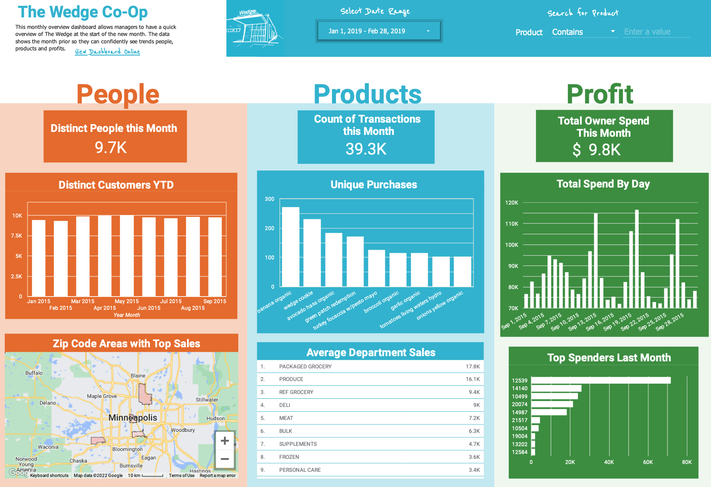

<h1 align="center">The Wedge Co-Op</h1>

<strong>Data Engineering Project with the Univeristy of Montana. </strong>
 

 
<h2>About</h2>
The Wedge Co-Op is the largest co-operative grocery store in the United States and is in Minneapolis, MN. Through a partnership with the co-op, we have data dating back to January 1, 2010 from the point-of-sale (POS) system that the Wedge developed. We have data through January 2017. This system logs every row of every receipt. This dataset is complex and was the product of manual export that was not consistent.  
 

<h2>Goal and requirements</h2>

To create a data pipeline that extracts zipped transaction records, cleans and uploads to Google BigQuery. Then, develop business reports that would serve a manager, owner or operations manager. 

 

<h2>Key learnings</h2>

- Python script to data extracting and cleaning via Pandas 
- Working with large data sets 
- Python, SQL and GBQ to extract sample and write into text file
- Create SQL summary tables using a single SQLite database via Python 

 

<h2>Data Visualization</h2>
In addition to this project, I created a dashboard with Looker Studio that gives a manager an overview of people, products and profits.
  
  

[Preview online here.](https://datastudio.google.com/u/0/reporting/1fe42f02-bf4d-4d90-b3ed-799c1d0e0a68/page/QzYj) 
